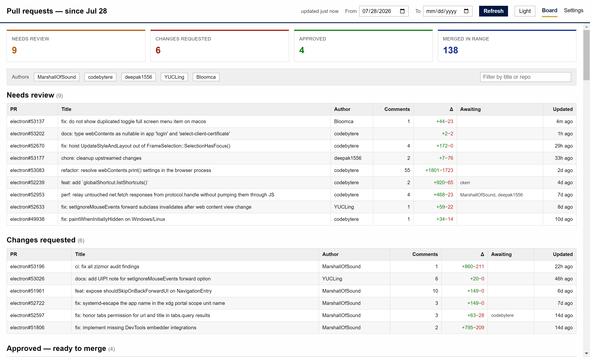
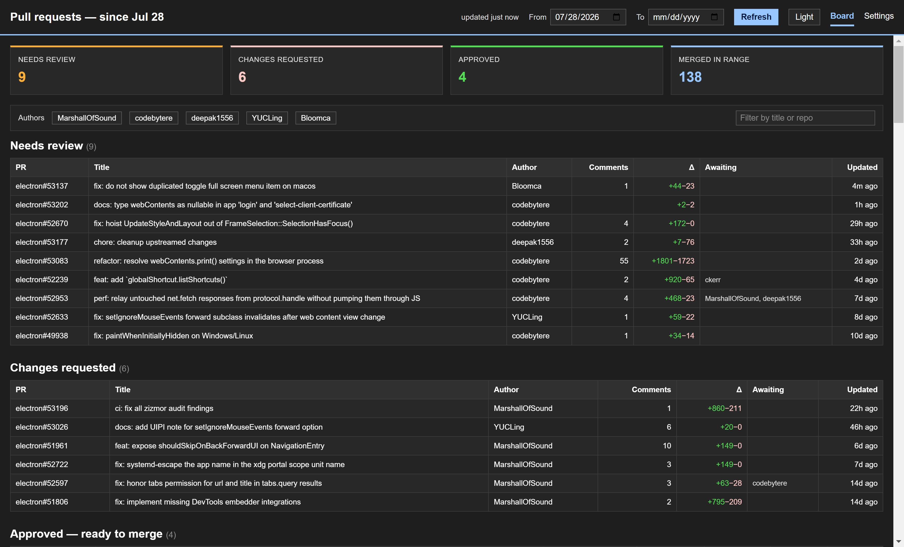

<p align="center"></p>

# pr-sweep

A portable desktop PR dashboard for teams that work in sprints across many repos in one
GitHub organization. One window that answers: **what's open, what needs review, what has
changes requested, what's approved, and what merged — this sprint.**




## Features

- **Status board**: dense tables for Needs review · Changes requested · Approved · Merged,
  bucketed from GitHub's actual `reviewDecision` — no labels or manual bookkeeping.
- **Date-range scoped**: pick From/To dates in the header and they persist; leave "To" empty
  for an open-ended view. Open PRs are scoped to activity within the range, merged PRs to
  merges within it — set the range to your sprint at sprint start and forget about it.
- **Team-scoped**: aggregate PRs authored by a configurable list of GitHub logins
  (leave the list empty to see the whole org), with per-author filter chips and free-text search.
- **Click a row** → PR opens in your browser.
- Auto-refresh (default every 5 min), manual Refresh button.
- Light/dark theme toggle; follows the OS on first run, choice persists per machine.
- Token stored encrypted at rest (Windows DPAPI via Electron safeStorage) — it never leaves
  the machine.

## Getting started

Grab the portable exe from Releases (no install — just run it), or build it yourself (below).
First launch asks for:

1. Your GitHub organization.
2. A personal access token (classic) with the `repo` and `read:org` scopes.
   If your org uses SAML SSO, remember to **Configure SSO** on the token and authorize the org —
   an unauthorized token gets no errors from GitHub's API, just silently empty results, and
   pr-sweep detects and explains this instead of showing an empty board.

Then add your team's GitHub logins in Settings and set the date range in the header.

## Development

```
npm install          # root orchestration deps
npm run setup        # desktop + renderer deps
npm run dev          # Angular dev server (:4301) + Electron with live reload
```

## Packaging

```
npm run package:win  # builds renderer + main, emits desktop/release/pr-sweep-*-portable.exe
```

## Architecture

```
desktop/
  src/main/           Electron main: window + IPC registration
    core/             plain services (no Electron imports where possible)
      config.service  org/authors/sprints/refresh persisted to userData/config.json
      token.store     PAT encrypted at rest via safeStorage (userData/token.bin)
      github.service  GraphQL search (ISSUE_ADVANCED backend), reviewDecision bucketing
  src/preload/        typed window.api bridge (contextIsolation on)
  src/shared/types.ts the whole main<->renderer contract
  renderer/           Angular app: BoardStore (signals) + board/settings pages
  e2e/screenshot.mjs  playwright-core drive script for visual checks
```

GitHub search quirks this encodes (verified against the live API):

- Multiple bare `author:` qualifiers AND together and match nothing; OR needs the
  advanced search backend (`type: ISSUE_ADVANCED` in GraphQL) and parentheses:
  `(author:a OR author:b)`.
- The advanced backend spells `review:changes_requested` with an underscore
  (legacy search uses a hyphen). pr-sweep buckets from `reviewDecision` instead.
- A null `reviewDecision` (repo without required-review branch protection) still
  means nobody approved — it buckets as *needs review*.
- A token that isn't SSO-authorized for an org gets no search errors — results are
  just silently filtered. The only reliable probe is whether the org's repositories
  are visible at all.

## License

[MIT](LICENSE)
