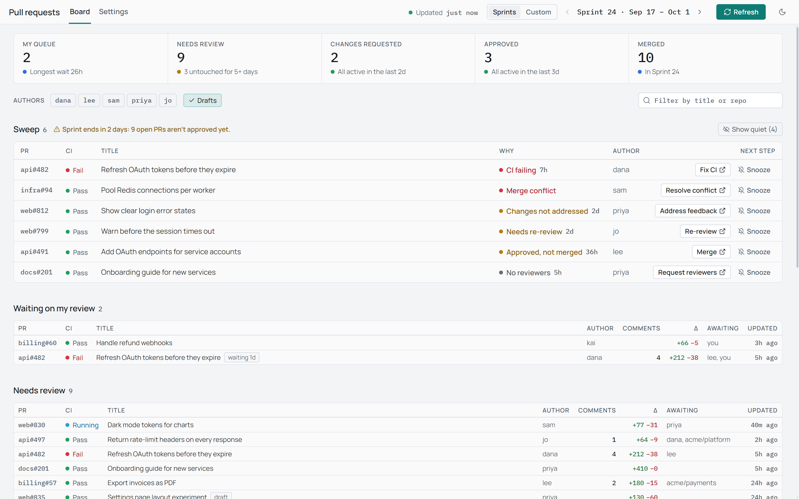

<h1>
  <picture>
    <source media="(prefers-color-scheme: dark)" srcset="docs/brand/lockup-dark.svg">
    
  </picture>
</h1>

**See where your team's pull requests are stuck this sprint.** One desktop window shows every PR
your team has open across a GitHub organization, sorted by what it's waiting on.

In 2022, Meta [studied its code review times](https://engineering.fb.com/2022/11/16/culture/meta-code-review-time-improving/).
The longer an engineer's slowest reviews took, the less satisfied they were with code review.
Meta built Nudgebot, which pings the reviewers most likely to act on a diff that has waited too
long. The share of diffs waiting more than three days for review dropped 12 percent.

Most teams don't have a Nudgebot. Their stuck PRs are spread across a dozen repos, and GitHub's
own dashboard shows what's waiting on *you*, not on the team. PR Sweep puts the whole team's PRs
on one board, sorted by GitHub's own review state, so nobody maintains labels or a project board.
Set the org, the team and your sprint schedule once. It refreshes every five minutes from the tray.

> **Status:** v0.12, in daily use. Windows and Linux builds are on [Releases](../../releases) and
> update themselves. Next is a sprint summary with a standup you can paste into chat. See
> [ROADMAP.md](ROADMAP.md).

<picture>
  <source media="(prefers-color-scheme: dark)" srcset="docs/screenshots/board-dark.png">
  
</picture>

## Install

Grab a build from [Releases](../../releases).

- **Windows:** the setup exe installs PR Sweep with a Start Menu entry and keeps it updated. The
  portable exe runs without installing, but doesn't update itself. Builds are signed with Azure
  Trusted Signing. If SmartScreen still warns while the certificate builds reputation, choose
  *More info → Run anyway*.
- **Linux:** the AppImage runs on any distro (`chmod +x pr-sweep-*.AppImage`, then run it) and
  updates itself. Your token is encrypted with the system keyring (GNOME Keyring or KWallet,
  through libsecret). Without a keyring it falls back to base64, which only obscures the token,
  so use a keyring on shared machines.
- **macOS:** not planned for now. See [ROADMAP.md](ROADMAP.md).

## First launch

1. Enter your GitHub organization.
2. Connect GitHub:
   - **Sign in with GitHub** (recommended). Enter a short code at `github.com/login/device`.
     There's no token to manage.
   - **Personal access token.** Use a classic token with `repo` and `read:org`. If your org uses
     SAML SSO, choose **Configure SSO** on the token and authorize the org. An unauthorized token
     gets empty results instead of errors, so PR Sweep checks for this and tells you.
3. In Settings, add your team's GitHub logins. Leave the list empty to see the whole org.
4. In Settings, under **Sprints**, set when your first sprint starts and how long sprints run.
   The board then opens on the current sprint. No sprints? Choose **Custom** in the top bar and
   set From and To dates instead. Leave To empty for an open-ended view.

> **Private orgs:** the first time someone signs in to an org that restricts third-party OAuth
> apps, GitHub asks them to **request access to `<org>`**. An org owner approves the app once,
> under **Settings → Third-party access → OAuth app access policy**, and everyone can sign in from
> then on. Until then the board stays empty even though sign-in worked.

## What it does

- **Sweeps** the team's open PRs for the ones that need a human: failing CI, merge conflicts,
  feedback nobody has addressed, pushes waiting on a re-review, approvals nobody merged, and PRs
  nobody was asked to review. Each row says how long it has been that way, with a one-click next
  step. PRs that are only waiting or stale, or untouched for a month, sit behind a toggle, and
  you can snooze a row until it changes or tomorrow. In a sprint's last two days, it also says how
  many open PRs aren't approved yet.
- **Knows your sprint.** Give it the first sprint's start and the sprint length, and the board
  opens on the current sprint, moves on when it ends, and steps back and forward with the arrows.
  Rename a sprint or make one longer, and the sprints after it follow.
- **Sorts** every open PR your team has, plus what merged in the sprint, into Needs review,
  Changes requested, Approved and Merged, from GitHub's `reviewDecision`. There are no labels to
  keep up.
- **Queues** the open PRs anywhere in the org that are waiting on *your* review, with how long
  each has waited.
- **Flags** failing CI on every open PR, and PRs untouched for longer than a threshold you set.
  Drafts stay hidden unless you show them.
- **Notifies** from the tray when a PR lands in your queue, or when one of yours is approved, gets
  changes requested or starts failing CI. The tray menu also counts what the Sweep has for the
  team. Closing the window keeps it watching.
- **Shares** a setup. Save org, team and sprint profiles, then export them as JSON for
  teammates to import. Tokens are never exported.
- **Opens instantly.** The last sweep is cached on disk, so the board appears at once and
  refreshes in the background.
- **Updates itself.** Installed builds check on launch and every 6 hours, download in the
  background, and apply the update when you click Restart.

## Your token stays with you

- **Read-only.** PR Sweep only reads from GitHub. It never comments, labels, approves or merges.
- **Encrypted at rest** through Electron's `safeStorage`: Windows DPAPI, or the keyring on Linux.
- **Only GitHub.** It talks to the GitHub API, to github.com for sign-in, and to GitHub Releases
  for updates. There's no telemetry and no PR Sweep server.
- **Open source**, so you can check all of this.

## Prior art

PR Sweep is narrow on purpose. If you want something else, these are good:

- [GitHub's pull requests dashboard](https://github.blog/changelog/2026-07-09-new-pull-requests-dashboard-is-now-generally-available/)
  is the place for what's waiting on *you*: review requests, failing CI and PRs ready to merge,
  with saved views.
- [Scheduled reminders](https://docs.github.com/en/organizations/organizing-members-into-teams/managing-scheduled-reminders-for-your-team)
  post a team's pending reviews to Slack on a schedule.
- [gh-dash](https://github.com/dlvhdr/gh-dash) is a configurable terminal dashboard for PRs and
  issues.
- [PR Radar](https://github.com/deployhq/pr-radar) is a browser extension that tracks your PRs
  across GitHub, GitLab and Bitbucket.
- [prdash](https://github.com/noamsto/prdash) is a terminal board of one repo's open PRs, with the
  next action for each.

PR Sweep covers one org, one team and one date range, on a board the whole team reads the same way.

## Under the hood

GitHub search has quirks, all checked against the live API. PR Sweep works around them:

- Several bare `author:` qualifiers AND together and match nothing. OR needs the advanced search
  backend (`type: ISSUE_ADVANCED`) and parentheses: `(author:a OR author:b)`.
- A null `reviewDecision` (a repo without required reviews) still means nobody approved, so it
  counts as needs review.
- A token that isn't SSO-authorized for an org gets no search errors, only filtered results. The
  reliable check is whether the org's repositories are visible at all.
- Search returns at most 1000 results per query, however you paginate. When a busy range would
  pass that, PR Sweep splits the date window in half and searches the halves.
- Paging through one long search is slow, so merged PRs are searched a week at a time, four
  weeks in parallel.
- Heavy searches can time out, as a 502 or as a 200 with a cut-off body. Those pages are re-sent
  at half the size, down to 25 rows, instead of being repeated as-is.
- Mergeability and review times are too costly to ask for on every searched PR. They come from
  one follow-up query, only for the PRs whose attention depends on them.
- Auto-refreshes ask only for PRs updated since the last sweep and patch the cached result. A
  manual Refresh always sweeps in full.

## Development

```sh
npm install          # root, desktop and renderer deps (rerun after pulling)
npm run dev          # Angular dev server (:4301) + Electron with live reload
npm run build        # renderer AOT build + main-process tsc (the typecheck)
npm test             # core service tests (build first)
```

```sh
npm run package:win    # desktop/release/pr-sweep-*-setup.exe + portable exe
npm run package:linux  # desktop/release/pr-sweep-*.AppImage (build on Linux)
```

Pushing a `v*` tag builds and publishes a release. Release builds are signed in CI with Azure
Trusted Signing (`build.win.azureSignOptions` in `desktop/package.json`), authenticated by the
`AZURE_TENANT_ID`, `AZURE_CLIENT_ID` and `AZURE_CLIENT_SECRET` repo secrets. Local packages are
unsigned unless those variables are set.

### Your own OAuth app

"Sign in with GitHub" needs a registered OAuth app's client ID. Public builds ship one. In a fork,
register your own (GitHub → Developer settings → **New OAuth App**, then enable **Device Flow**)
and either set `DEFAULT_OAUTH_CLIENT_ID` in `desktop/src/main/core/oauth.constants.ts` before
building, or paste it into **Settings → OAuth App client ID**. The client ID is public by design,
since device flow has no secret.

## Contributing

Issues and pull requests are welcome. The next unchecked item in [ROADMAP.md](ROADMAP.md) is
what's being built, and [AGENTS.md](AGENTS.md) lists the rules the code follows, including which
GitHub fields are expensive to fetch.

## License

[MIT](LICENSE)
